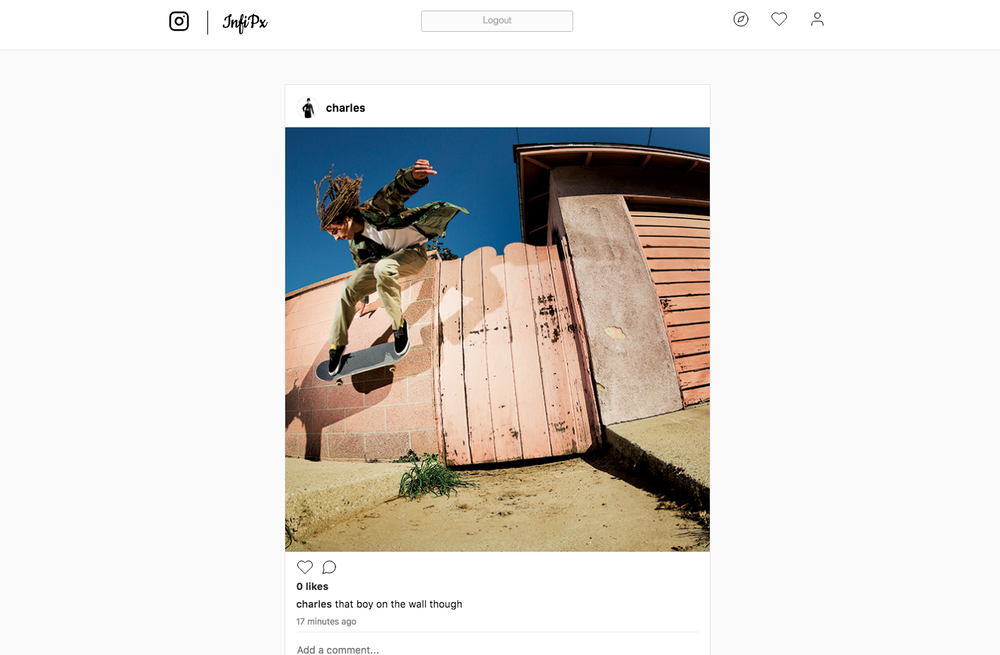

# InfiPx

[Infipx](https://infipx.herokuapp.com/)

Infipx is a full-stack web application inspired by Instagram. It utilizes Ruby on Rails on the backend, a PostgreSQL database, and React.js with a Redux architectural framework on the frontend.

## Features & Implementation

### Secure User Authentication

Users can sign up and log in with validations in Rails' models to ensure that only valid data is saved to the database. Only registered users can access application features. Passwords are hashed using BCrypt.

### Posts Feed
Posts are stored in the database table, with columns for `id`, `user_id` that references the person who uploaded the post, `image` which is an attached file uploaded to AWS (Amazon Web Services). There is an optional column of `description` of a post. Once logged in, user is redirected to posts feed page and an AJAX call is made to the database and posts of the users that current user is following are fetched.

Each post on posts feed page has owner's avatar, username, image, likes and comments associated to the post

Posts are created through update post form, where user can choose image and add a caption to a post.
As a post requires a `user_id` column to be successfully saved, posts are always created through current user using current_user in the Rails backend.

hero
### Users
Users are stored in the database in a `users` table. User's show page displays their details and posts. Users can edit their own data and change profile photo.

### Likes and Comments
Users can like and unlike any post by clicking on the heart icon which turns red when liked, and transparent when not.

User can post a comment by clicking on a cloud icon which gives focus to an input field and when user start typing comment can be submitted. Any
comment made by the user can be deleted, along with any comment on a user's photo.

### Follows

User can follow and unfollow any other user.

## Future Directions for the Project

In addition to the features already implemented, I plan to continue work on this project.  The next steps for Infipx are outlined below.
* [ ] Search Bar
* [ ] Search Bar
* [ ] Direct Messaging
* [ ] Hashtags
* [ ] Full responsiveness (optimization for mobile devices)
* [ ] Infinite scroll
